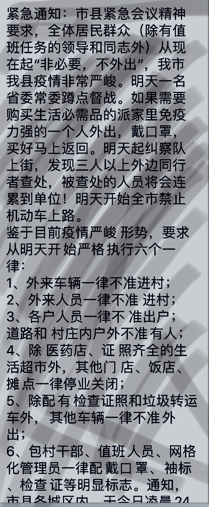

# &#9856; &nbsp; 「光 怪 陸 離」

> This blog aims to express my personnal views to some phenomena behind the 「Novel Coronavirus 」. ***This disclaimer informs readers that the views, thoughts, and opinions expressed in the text belong solely to the author, and not necessarily to the author's employer, organization, committee or other group or individual.***

<escape><!-- more --></escape>

疫情擴散，事情也變得光怪陸離。裹挾著群眾的輿論洪流席捲八方，每一個人幾乎喪失了獨立思考的空間。在這台由「恐懼」「猜疑」「焦慮」驅動的隆隆戰車之上，有人心懷鬼胎，「搶佔新聞熱點」「發國難財」「樹立幷激化矛盾」。有人愚昧無知，「封路鎖區」「樹立敵人」「道德綁架」。但被綁在滾滾車輪上的人是「無所去從」的大多數人。

> 「在群體之中，絕對不存在理性的人。因為正如我們前面所說，群體能夠消滅個人的獨立意識，獨立的思考能力。事實上，早在他們的獨立意識喪失之前，他們的思想與感情就已被群體所同化。」
>
> —  Gustave Le Bon

 現在又何不是暴民的狂歡呢。只不過操縱輿論是其他有心人罷了。

在遠離重災區「武漢」的我們，對於這場「災難」所有的感知，除了窗外小區門口級級登記核查的工作人員，除了出門外出所帶來的不便利性之外。我們，更多的消息來源是來自網絡。人們賦闲在家一定程度上加快了信息傳播的「速度」，同時也加速了信息 **「失真&變異」** 的速度。面對 ZB 級`1 ZB = 1,000,000,000,000 GB` 的數據量，我們會感到窒息。在窒息感之後是大腦宕機，從此我們關閉了更高級別的思考模塊，轉向一種簡單且原始的本能模式 「趋同」。對於某些事物，蜂擁而至又決然離開。這種大規模的輿論流量也是很多人寧願看到的。這就是群聚的強大力量。

群體不能理解上半年香港地區爆發動亂時那些「香港廢青」所表現出來的不可理喻，但諷刺的是他們現在恰恰也處於這樣的狀態。只不過是處於我們的輿論體系之內，這種行為是「Acceptable」的。但是這種群體性失真的本質在兩件事上我認為沒有什麼太大區別。

還是那句話。「 Think Individually. 」如果不能這樣，起碼在我們不能想清楚之前我們理應「 沉默 」。最重要的。還是「對自己的發言負責」。這是作為一個信息傳播體最基本理應恪守的準則。

> 我很尊敬他，很多人都很尊敬他
>
> 但其实可悲的是， 你我的尊敬， 在某些人眼中， 只是一 份值得被利用的情感。
>
> 从幵始到现在，我一直讨厌所谓“八君子”的称谓，不是 他们不配这个称谓，而是许多提出这个称谓的人，只是 把他们当做煽动仇恨、制造对立的工具人，这是捧杀， 这是亵渎，其实这很无耻。我见过很多历史上，可敬又 无辜的人被别有用心者利用，如今，我又看到历史在反 复。
>
> 说句诛心的话：其实在一些人眼中，他的死亡比活着更 “有用”。死去的“先知”，更悲壮，矛盾更尖锐，更有戏 剧冲突效果，更能收割眼泪与关注。不会说话的死人， 更能被随心所欲地塑造成他们想要的形象，或是悲天悯 人的圣人，或是对抗暴政的英雄。
>
> — Anonymous User

最後再 po 一張為我痛恨至極的 「應對策略」。(此地為縣級市，當地目前確診者1人已出院，隔離觀察者若干人。存在有武漢務工人員返程情況) 『當然也有可能是無奈而為之，但我保持存疑態度。』

結合之前在網絡上傳播很火的「河南式勸返」。在黑色幽默之後反映出的是「執行無力」的无奈。或是「簡單粗暴」的處理辦法。在這種特殊時期，公權力會漸進地以對個體權利進行侵害。以「控制疫情」為名義極大的擴大了底層社區鄉鎮幹部的權限，進行非官方統一性的「管理控制」，是對我們法治進行的重擊。（許多村鎮、社區進行門禁管控是自治式的，有很多東西處例如管理辦法、手段是於法令之外未能細化的。）

與我本人而言，服從管理是對自己負責也是對他人負責。但是將這種本質上脫離規程的公權侵佔私權的行為進行美化宣揚，並為其他單位所效仿，這一點我絕對不能苟同。

以上。
